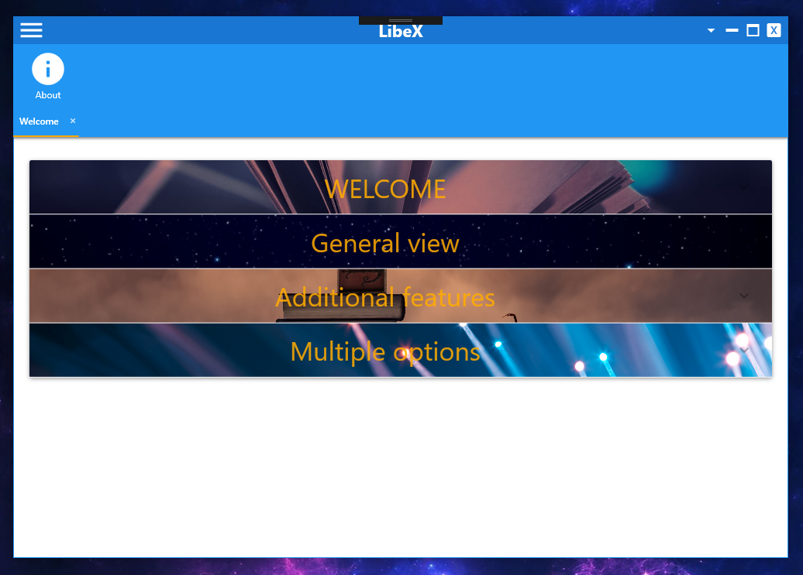
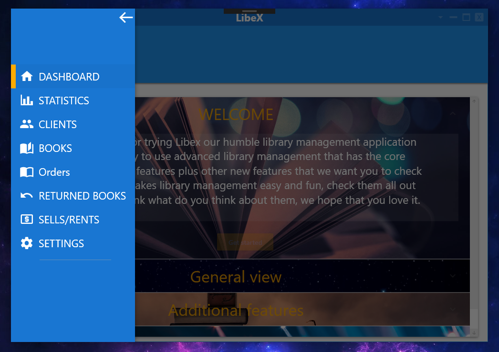
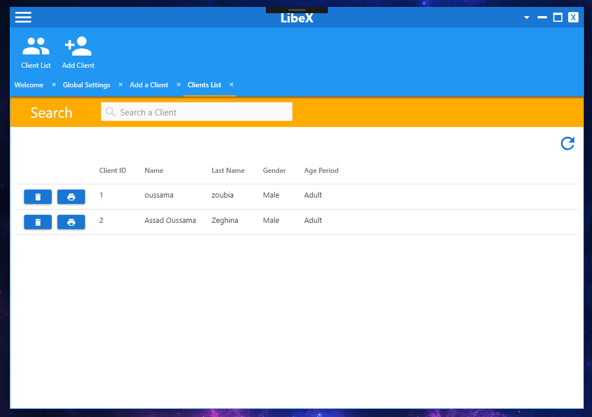
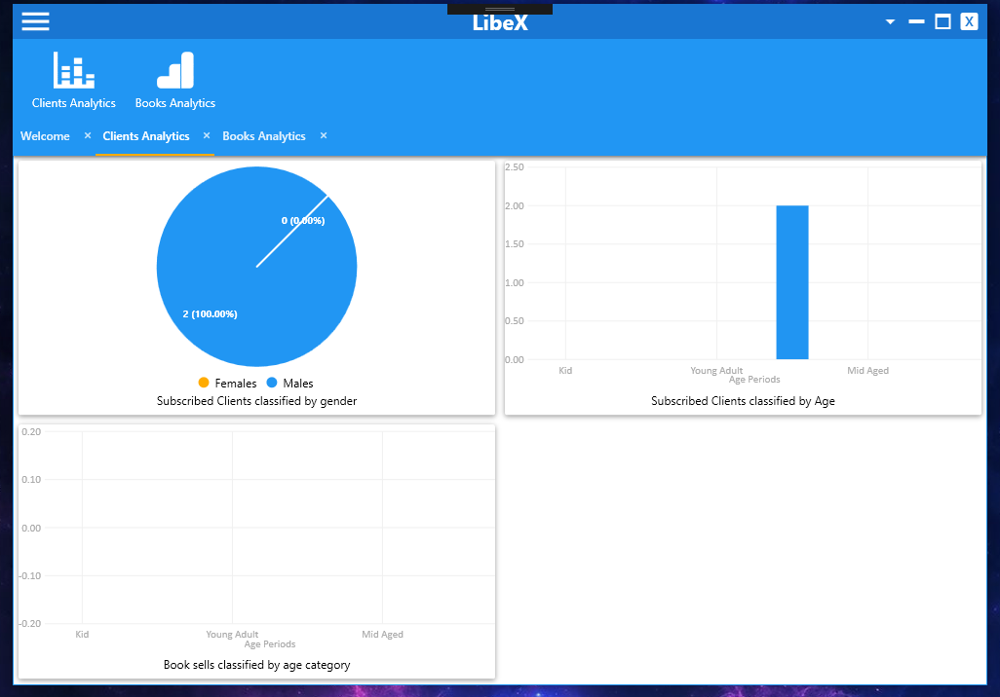
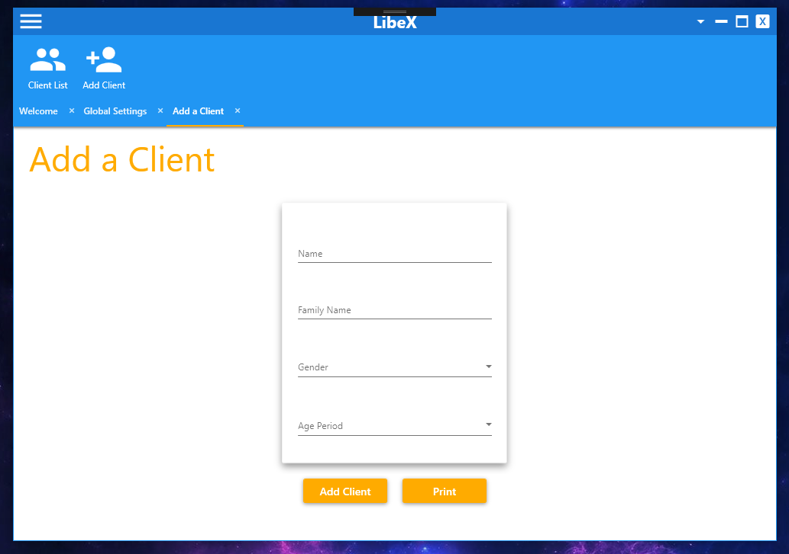
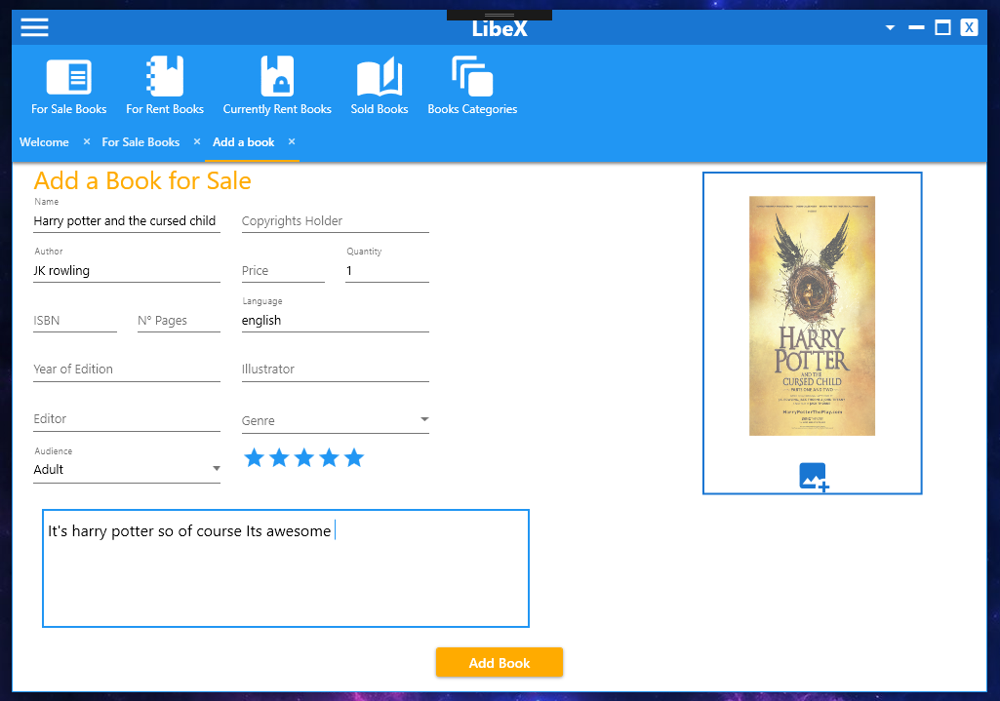
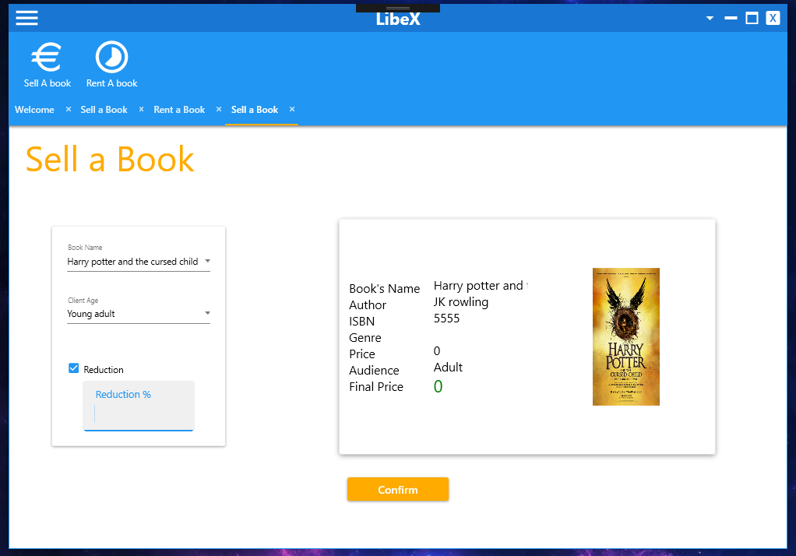
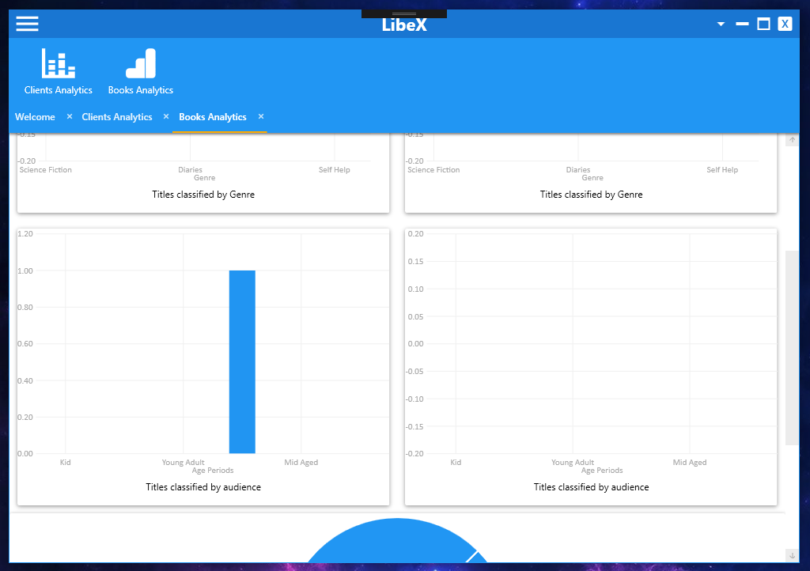
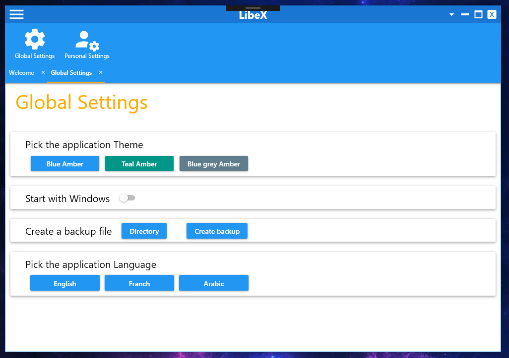

# LibeX Library Stock Management App
## Table of Contents
* [Introduction](#introduction)
* [Prerequisites](#prerequisites)
* [Setup](#setup)
* [Built with](#built-with)
* [Contributers](#contributers)
* [Screenshots](#screenshots)


## Introduction
Libex is a library stock mangement desktop application (for windows only), it makes a library management as easy as it gets, with an easy to use and an ergonimic interface, an eye appealing modern flat design with a possibility to change the application theme to up to three flat colors, it offers all the basic featues of library mangement (adding, editing and deleting books, clients or orders) to advanced features like a statistics system that makes tracking sales or resources easier...


it provides other features like : 


    - multi language support (arabic, french and english ) - this feature is not finished
    - multiple color themes to choose from 
    - data backup system 
    - books tracking system ( tracking the rent books that are returning today , or those that are delayed ) 
    - a books search features 


## Prerequisites
* [Material Design in XAML Plugin](http://materialdesigninxaml.net/)
* [SQLite/SQL server compact v4.0 toolbox](https://marketplace.visualstudio.com/items?itemName=ErikEJ.SQLServerCompactSQLiteToolbox)
* [Microsoft SQL Server Compact v4.0](https://www.microsoft.com/fr-fr/download/details.aspx?id=17876)

## Setup
1- First you start by cloning the project in your hard drive <br />
    ```
    git clone https://github.com/Ozoubia/Libex.git
    ```
   
2- Open the project in Visual studio IDE <br />
3- You will have to install the missing packages, Go to NuGet Package Manager in VS, It'll ask you to download the missing packages 
automatically which is the best option, wait for them to be installed and you're good to go.<br />
4- If the automatic package download fails you have to download each package manually, here are the packages:
   * MaterialDesignThemes
   * SQL server compact v4
   * DotNetZip 
   * Dragablz
   * LiveCharts 


**PS** : Sometimes installing the packages automatically will install **EntityFramework.SQlServerCompact** along with them (which in this case we don't need and it will cause an error, so if it is installed go to NuGet Package Manager and remove it from the project) 


## Built with 
- Visual studio 2017 IDE
- C# .NET 4.5
- Material Design in XAML 
- Dragablz
- LiveCharts

## Contributers
* [Oussama Zoubia](https://github.com/Ozoubia) 
* [Assaad Oussama Zeghina](https://github.com/DrAssaadZ)

## Screenshots
<p align="center"></p>
<p align="center"></p>
<p align="center"></p>
<p align="center"></p>
<p align="center"></p>
<p align="center"></p>
<p align="center"></p>
<p align="center"></p>
<p align="center"></p>


